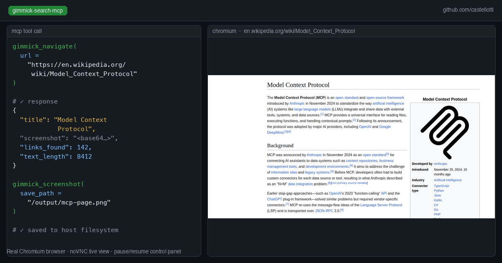
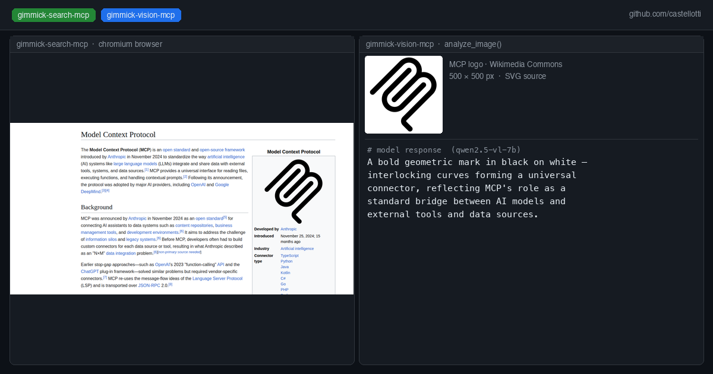

# gimmick-search-mcp

An MCP server that gives Claude Code and other agents a real Chromium browser with live visual feedback.

Unlike headless browser tools or text-only fetch tools, gimmick-search runs a visible Chromium instance on a virtual display (Xvfb) inside Docker, accessible via noVNC at port 6080. A control panel at port 6081 shows the activity log and lets you send messages to Claude or pause/resume/stop the session mid-run.

Every browser tool returns a base64 PNG screenshot alongside text output, so multimodal models can read the page visually without a separate vision call.

## Why this exists

Most web research tasks fail with headless browsers or plain HTTP fetchers because:
- JavaScript-heavy sites (Alibaba, dynamic SPAs) need a real rendering engine
- CAPTCHAs and bot detection need human-looking browsing patterns
- Visual verification matters — screenshots let you catch when navigation went wrong

gimmick-search solves all three while keeping Claude in the loop with real-time visual feedback.





## Optional: Combine with gimmick-vision

Claude Code and other agents (especially when running against a local LLM like Qwen3-Coder-Next) has no built-in vision capability. gimmick-vision adds three image analysis tools to the MCP toolset, routing vision requests to a separate local model — for example Qwen2.5-VL-7B — without any cloud API calls.

## Tools provided

| Tool | Description |
|------|-------------|
| `gimmick_open` | Launch the browser. Reports any existing checkpoint. Must be called first. |
| `gimmick_close` | Close the browser and clean up. Call at the end of every session. |
| `gimmick_navigate` | Navigate to a URL. Returns title + screenshot. |
| `gimmick_search` | Search on Google, Bing, DuckDuckGo, Alibaba, or Made-in-China. Returns page text, links, screenshot. |
| `gimmick_click` | Click an element by visible text or accessible name. |
| `gimmick_type` | Type into an input field, optionally submitting. |
| `gimmick_scroll` | Scroll the page by pixels or to a fraction of page height. |
| `gimmick_extract` | Extract all visible text and links from the current page. |
| `gimmick_screenshot` | Take a screenshot, optionally saving it to disk. |
| `gimmick_evaluate` | Run arbitrary JavaScript in the page context. |
| `gimmick_wait` | Wait for a CSS selector or a fixed number of milliseconds. |
| `gimmick_save_checkpoint` | Save current URL, title, and cookies to `/checkpoints/gimmick-checkpoint.json`. |
| `gimmick_load_checkpoint` | Restore cookies from the last checkpoint, optionally navigating back to the saved URL. |
| `gimmick_check_user_input` | Poll for messages or control signals (pause/resume/stop) sent via the control panel. Call this every ~8 tool calls. |
| `gimmick_pause` | Pause the session (blocks Claude from continuing until resumed). |

## Ports

| Port | Service |
|------|---------|
| 6080 | noVNC — live browser view in your browser at `http://localhost:6080/vnc.html` |
| 6081 | Control panel — activity log, pause/resume/stop buttons, send messages to Claude |

## Usage with Claude Code (via Docker)

Add to your `.mcp.json`:

```json
{
  "mcpServers": {
    "gimmick-search": {
      "command": "/bin/sh",
      "args": [
        "-c",
        "docker rm -f gimmick-search-mcp 2>/dev/null; mkdir -p \"$(pwd)/output/.checkpoints\" \"$(pwd)/output/images\"; docker run --rm -i --name gimmick-search-mcp -p 6080:6080 -p 6081:6081 --shm-size=256m -v \"$(pwd)/output/.checkpoints:/checkpoints\" -v \"$(pwd)/output:/output\" gimmick-search-mcp:latest"
      ]
    }
  }
}
```

`--shm-size=256m` is required — Chromium needs shared memory for rendering.

The `-v` mounts make checkpoints and screenshots available on the host filesystem.

## Building the Docker image

```bash
git clone https://github.com/castellotti/gimmick-search-mcp.git
cd gimmick-search-mcp
docker build -t gimmick-search-mcp:latest .
```

## Building locally (TypeScript, no Docker)

```bash
npm install
npm run build
```

The compiled output is in `build/index.js`. The server expects to run inside a container with Xvfb, x11vnc, websockify, and Playwright's Chromium installed (see the Dockerfile).

## Checkpoint / resume flow

Checkpoints save the current URL, page title, and all browser cookies to disk. On the next session, `gimmick_open` reports the saved checkpoint and the agent can call `gimmick_load_checkpoint({ navigate: true })` to restore the full browser state and continue from where it left off.

```
gimmick_open()                           // always first
  └─ research loop:
       gimmick_navigate / gimmick_search / gimmick_click / gimmick_scroll ...
       gimmick_extract(max_length=30000)
       gimmick_screenshot(save_path="/output/images/page_01.png")
       gimmick_check_user_input()         // poll every ~8 calls
       gimmick_save_checkpoint()          // after each major step
gimmick_close()                          // always last
```

## Saving screenshots to disk

Use the `save_path` parameter with any path under the mounted `/output` volume:

```
gimmick_screenshot(save_path="/output/images/result_01.png")
```

The file appears at `./output/images/result_01.png` on the host.

## Vision preview integration

If you run [gimmick-vision-mcp](https://github.com/castellotti/gimmick-vision-mcp) alongside gimmick-search-mcp, it can push image analysis results to the control panel at `http://localhost:6081/api/vision` for a real-time vision preview in the sidebar.

## Environment variables

None required. The browser path is auto-detected from `PLAYWRIGHT_BROWSERS_PATH` (defaults to `/ms-playwright`, set by the Playwright base image).

## Requirements

- Docker (recommended) — the Dockerfile handles all system dependencies
- Or: Node.js 20+, Xvfb, x11vnc, websockify, noVNC, and Playwright's Chromium installed natively

## License

MIT
